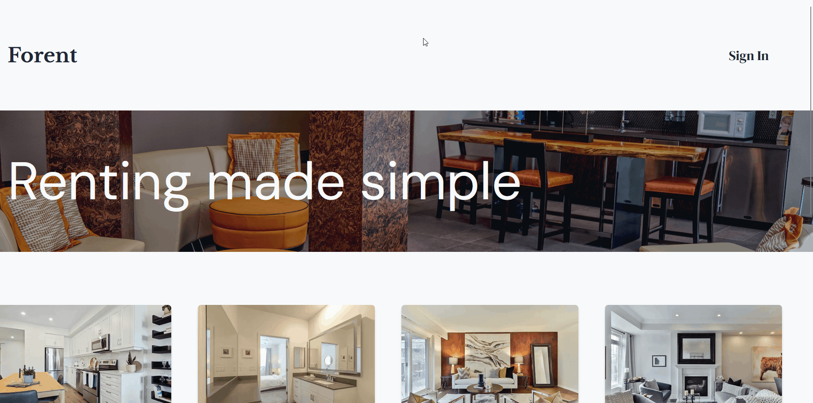
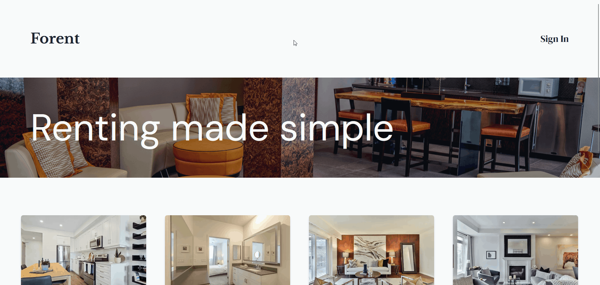

# Forent 🏡

Apartment rental clone website.

## Showcase

#### Homepage

#### Listings page

#### Listings' details & Information

#### Sign in via E-Mail

#### Sign in using Google OAauth

#### Creating a listing

## What technologies were used ⚙️

- [NextJS](https://nextjs.org/) - React Framework
- [NextAuth](https://next-auth.js.org/) - Authentication
- [Storybook](https://storybook.js.org/) - Design & Testing (a11y & visual)
- [Jest](https://jestjs.io/) - Testing (unit)
- [Prisma](https://www.prisma.io/) - Database ORM and design
  - [PostgreSQL](https://www.postgresql.org/) - Database (Prisma handles all the communication)
- [Tailwind CSS](https://tailwindcss.com/) - Styling
- [Cypress](https://www.cypress.io/) - Testing (component & e2e)

## What each of the directories are for 📂

| Directory    | Purpose                                               |
| ------------ | ----------------------------------------------------- |
| `.github`    | GitHub templates and workflow                         |
| `.storybook` | Storybook config                                      |
| `app`        | Application itself                                    |
| `cypress`    | Component and E2E tests                               |
| `components` | UI pieces                                             |
| `lib`        | Functions                                             |
| `prisma`     | DB schema and changes                                 |
| `stories`    | Design examples, accessibility tests and visual tests |
| `tests`      | Unit tests                                            |

## How quality is assured 🧪

> **Test all (as much as possible)**

1. Unit tests are for general & functional behavior [Jest]
2. Component tests are for evaluating the component's values (text) and display (existence and visibility in the webpage) [Cypress]
3. UI tests are for maintaining the component's design consitency [Storybook, Chromatic]
4. E2E tests are for user behavior [Cypress]

> It is better to test the component's UI in Storybook. Why?
> 1. In Cypress, you have to explicitly mention (eg.) the color or layout of the component
> 2. In Storybook w/ Chromatic, it automatically detects the changes and notifies for any changes.
>
> > Special cases might apply. Example, different layouts for different screen dimensions requring some components
> > to be hidden while others are visible.

*All* the lines and branches.

*As much as possible*, since some parts (like `component` and `e2e` tests) are better tested manually. 

This is possible when workflows are too complex for `e2e` tests that it makes more sense to test it manually in the browser or when live data is difficult to be provided when testing `component`s.
